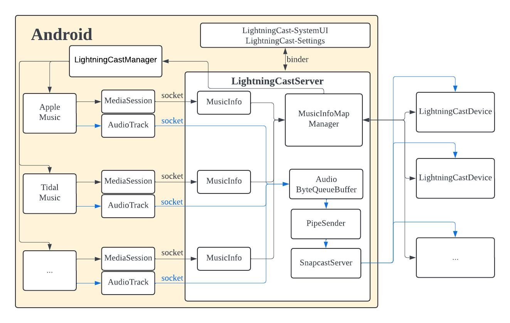

# LightningCast Architecture Design

[English](./README.md) | [简体中文](./doc/README_zh.md)

## Overview

LightningCast customizes the Android LineageOS to capture the original music data from the NATIVE FRAMEWORK layer of the app before mixing. It then casts the audio to all selected cast devices for synchronized playback. Additionally, it synchronizes the current song's metadata, cover art, and playback progress on the cast device. Each cast device can control the current app's playback (e.g., pause/play) and maintain synchronization with the Android system's volume/mute state.

## Framework Diagram

**MediaSession, AudioTrack** are part of the Android media framework under `android.media.*` in the APPLICATION FRAMEWORK, as well as in the NATIVE FRAMEWORK layer's `AudioTrack.cpp`. 

- **Blue arrows** represent the direction of audio data flow.
- **Black arrows** represent the flow of other data.

LightningCast mainly consists of the following components:

- **LightningCastServer**: The communication hub and decision-making center for LightningCast.
- **MediaSession**: Retrieves and transmits metadata to the LightningCastServer.
- **AudioTrack**: Retrieves audio formats, captures audio data, and transmits it to the LightningCastServer.
- **LightningCast-SystemUI, LightningCast-Settings**: Add LightningCast items to the SystemUI and Settings, retrieve all online LightningCast devices, and select or deselect a LightningCast device.
- **LightningCastManager, LightningCastApplication**: Implements reverse control and detects the online/offline status of MDNS LightningCast devices.

## Components

### LightningCastServer

The **LightningCastServer** is a native system service that runs continuously after the Android device starts and automatically restarts even after a crash. It communicates with other Android modules using Binder or Unix Domain Socket, and with LightningCast devices using TCP Socket.

The LightningCastServer creates a Binder service `LightningcastService` and 5 threads:

1. **MessageConsumerThread**: Handles messages from the MessageQueue.
2. **QueryMDNSThread**: Checks if LightningCast devices are online.
3. **PipeSenderThread**: Handles sending audio data to be casted.
4. **SnapServerThread**: Handles the casting of audio data.
5. **ConnectThread**: Manages connections with multiple clients.

#### (1) Binder Service `LightningcastService`

The Binder API created by the `LightningcastService` includes a method called `getCastDeviceSize`, which is used by **AudioTrack**. Other APIs are used by **LightningCast-SystemUI** and **LightningCast-Settings**. After receiving a call from **LightningCast-SystemUI** or **LightningCast-Settings**, the server composes a JSON message and stores it in a MessageQueue to avoid blocking the UI.

#### (2) MessageConsumer Thread

This thread sequentially processes each message in the MessageQueue. These messages include operations for retrieving and setting LightningCast device properties, selecting or deselecting devices, and setting the device’s volume or mute state.

#### (3) QueryMDNS Thread

If a LightningCast device goes offline due to a shutdown or network disconnection (without sending an offline message), the QueryMDNS thread checks every 5 seconds whether the device is still online. If the device is offline, it removes it from the list of online devices and notifies the UI to update.

#### (4) PipeSender Thread

The PipeSender thread creates a named pipe (`snapfifo`). After receiving a message to start playback, the server notifies the thread to enter a loop, reading audio data from a `ByteQueueBuffer` and writing it to `snapfifo`, where the SnapServer thread will read it.

#### (5) SnapServer Thread

When the server receives a start playback message, the SnapServer thread begins processing by reading audio data from `snapfifo` and casting it. The buffer time is adjusted based on the audio sample rate.

#### (6) Connect Thread

The Connect thread creates 4 socket servers:

- Unix domain socket servers for transferring Android non-audio data (like Metadata).
- A Unix domain socket server for audio data transfer.
- TCP servers for non-audio communication (like Metadata) with LightningCast devices.
- TCP servers for device configuration communication with LightningCast devices.

For each connected client, a `ClientInfo` instance is created, containing the client’s file descriptor (fd), type, and IP address. Based on the type, the appropriate handling process is triggered.

#### (a) Communication with Other Android Modules

The **MediaSession** layer is Java code, and the **AudioTrack** layer is C++ code, but both belong to the same app and share the same UID and PackageName. The LightningCastServer uses this information to create or update the corresponding `MusicInfo` for the app. Each app corresponds to one `MusicInfo`, which includes metadata, cover art, sample rate, etc.

The server has an `mActive_uid` variable to indicate which app is currently casting. When receiving the audio format (sample rate) from AudioTrack, it only saves the UID, PortID, and audio format, without updating the `MusicInfo`. This is because one app can have multiple AudioTracks, particularly for apps with crossfade functionality. When the `AudioTrack` starts, the server disconnects all non-audio connections and sends metadata, audio format, duration, and start play information to the connected devices. It then instructs other apps to stop playing.

#### (b) Communication with LightningCast Devices

When a LightningCast device is selected, the server connects to the device’s TCP server and sends an open message. The LightningCast device then connects back to the LightningCastServer. The server sends metadata and receives reverse control messages from the device. If the server does not receive a heartbeat message from the device for 5 seconds, it disconnects.

### MediaSession

**MediaSession** is a core component of Android's media playback system, used by almost all music apps. It stores metadata and cover art. When the app starts playing a song, the server sends the song's metadata, cover art, and duration in a JSON format, including the UID and PackageName for identification. If the cover art is in Bitmap format, it is sent separately as binary data. The cover art's URL format is `http://localhost:8090/lightningcast_$(uid).jpg`, with a dedicated HTTP server parsing these JPG images.

### AudioTrack

When the app starts playing a song, the `AudioTrack.set` function is called to set the audio format. If the audio is of the MUSIC type, two Unix domain socket clients are created to connect to the LightningCastServer: one for sending audio control messages (start, pause, stop) and another for sending the audio data. Since an app can have multiple AudioTracks, the system distinguishes them by using the `PortID` in addition to the UID and PackageName. If any LightningCast device is connected, the audio data is sent to the server and then muted by setting the data to zero.

### LightningCast-SystemUI, LightningCast-Settings

The **SystemUI** and **Settings** are customized to add a LightningCast item, which communicates bi-directionally with the LightningCastServer through Binder. When accessing the LightningCast item, the UI retrieves all online LightningCast devices and their current connection status. Users can select or deselect devices. If only one device is online, it is selected by default. Volume and mute adjustments also trigger corresponding Binder API calls to the server. The server updates the UI in real-time when changes occur, such as a device going offline or volume adjustments.

### LightningCastManager, LightningCastApplication

Both **LightningCastManager** and **LightningCastApplication** are automatically loaded when Android starts. The **LightningCastManager** handles reverse control, allowing LightningCast devices (via buttons or remote control) to control the app’s playback or adjust Android's volume. **LightningCastApplication** is responsible for MDNS discovery of LightningCast devices. When a device goes online or offline, it triggers calls to the `LightningCastServer` Binder API, which then updates **LightningCast-SystemUI** and **LightningCast-Settings**.
