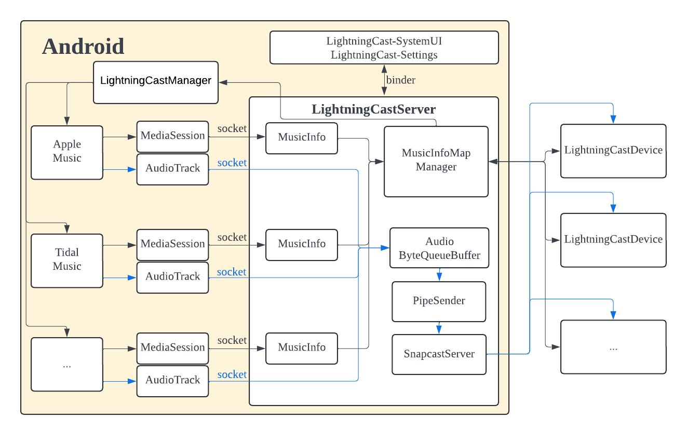

# LightningCast 架构设计

[English](../README.md) | [简体中文](./README_zh.md)

## 概述

LightningCast 通过自定义 Android LineageOS，捕获 APP 在混音之前 NATIVE FRAMEWORK 层的原始音乐数据，并将音频数据同步播放到所有选择的 Cast 设备。此外，它会同步当前歌曲的 Metadata、封面及播放进度。每个 Cast 设备都可以反向控制当前 APP 的播放（如暂停/播放），并与 Android 系统的音量/静音状态保持同步。

## 框架图

**MediaSession、AudioTrack** 是 Android 媒体框架的一部分，位于 APPLICATION FRAMEWORK 中的 `android.media.*` 和 NATIVE FRAMEWORK 层的 `AudioTrack.cpp`。

- **蓝色箭头** 表示音频数据的流向。
- **黑色箭头** 表示其他数据的流向。

LightningCast 主要由以下几个部分组成：

- **LightningCastServer**：LightningCast 的通信中枢和决策中心。
- **MediaSession**：获取并传输 Metadata 给 LightningCastServer。
- **AudioTrack**：获取音频格式，捕获音频数据，并传输给 LightningCastServer。
- **LightningCast-SystemUI, LightningCast-Settings**：在 SystemUI 和 Settings 中添加 LightningCast 项目，获取所有在线的 LightningCast 设备，并选择或取消选择设备。
- **LightningCastManager, LightningCastApplication**：实现反向控制，并检测 MDNS LightningCast 设备的上下线状态。

## 组件

### LightningCastServer

**LightningCastServer** 是一个 Native 系统服务，在 Android 设备启动后持续运行，即使崩溃后也会自动重启。它通过 Binder 或 Unix Domain Socket 与 Android 内部其他模块进行通信，通过 TCP Socket 与 LightningCast 设备通信。

LightningCastServer 会创建一个 Binder 服务 `LightningcastService` 和 5 个线程：

1. **MessageConsumerThread**：处理来自 MessageQueue 的消息。
2. **QueryMDNSThread**：检查 LightningCast 设备是否在线。
3. **PipeSenderThread**：处理音频数据的发送。
4. **SnapServerThread**：处理音频数据的播放。
5. **ConnectThread**：管理与多个客户端的连接。

#### (1) Binder 服务 `LightningcastService`

`LightningcastService` 创建的 Binder API 包括一个 `getCastDeviceSize` 方法，用于 **AudioTrack** 调用。其他 API 则由 **LightningCast-SystemUI** 和 **LightningCast-Settings** 调用。收到这些调用后，LightningCastServer 会组成 JSON 格式的消息并将其存入 MessageQueue，避免 SystemUI 或 Settings 阻塞。

#### (2) MessageConsumer 线程

此线程依次处理 MessageQueue 中的每条消息。这些消息包括获取和设置 LightningCast 设备属性、选择或取消选择设备，以及设置设备的音量或静音状态等操作。

#### (3) QueryMDNS 线程

如果 LightningCast 设备因关机或拔网线而未发送下线消息，QueryMDNS 线程每 5 秒检查一次设备是否在线。如果设备不在线，则从在线设备列表中移除，并通知 UI 更新设备列表。

#### (4) PipeSender 线程

PipeSender 线程会创建一个名为 `snapfifo` 的命名管道（pipe）。收到开始播放消息后，LightningCastServer 会通知该线程进入循环，将音频数据从 `ByteQueueBuffer` 中读取并写入 `snapfifo`，供 SnapServer 线程读取。

#### (5) SnapServer 线程

当服务器收到开始播放消息后，SnapServer 线程开始工作，读取 `snapfifo` 中的数据并将其播放出去。根据音频采样率的不同，缓冲时间也会相应调整。

#### (6) Connect 线程

Connect 线程创建 4 个 socket 服务器：

- 用于传输 Android 内部非音频数据（如 Metadata）的 Unix domain socket 服务器。
- 用于传输音频数据的 Unix domain socket 服务器。
- 用于与 LightningCast 设备通信的非音频数据（如 Metadata）的 TCP 服务器。
- 用于与 LightningCast 设备通信、获取和设置设备配置的 TCP 服务器。

对于每个连接的客户端，都会创建一个 `ClientInfo` 实例，保存该客户端的文件描述符（fd）、类型和 IP 地址。根据类型，服务器会选择不同的处理流程。

#### (a) 与其他 Android 模块的通信

**MediaSession** 层是 Java 代码，**AudioTrack** 层是 C++ 代码，但都属于同一个 APP，且共享相同的 UID 和 PackageName。LightningCastServer 会根据这些信息创建或更新对应的 `MusicInfo`，每个 APP 对应一个 `MusicInfo`，其中包含该 APP 的 Metadata、封面、采样率等信息。

服务器有一个 `mActive_uid` 变量，表示当前正在播放的 APP。当收到 AudioTrack 的采样率（音频格式）设置时，服务器只保存该连接的 UID、PortID 和音频格式，不会更新该 UID 对应的 `MusicInfo`。这是因为同一个 APP 可能会有多个 AudioTrack，特别是在使用 crossfade 功能的 APP 中较为常见。之后，在收到 AudioTrack 的 start 消息后，服务器会断开除当前 AudioTrack 外所有该 APP 的音频和非音频数据连接，并将 Metadata、音频格式、时长和开始播放信息发送给所有连接的设备。然后通知 PipeSender 和 SnapServer 开始工作，并让其他 APP 停止播放。

#### (b) 与 LightningCast 设备的通信

在 Android 中选择 LightningCast 设备时，LightningCastServer 会作为 TCP 客户端连接到 LightningCast 设备的 TCP 服务器，发送 open 消息。LightningCast 设备收到后会作为 TCP 客户端连接回 LightningCastServer，服务器将发送 Metadata 等信息给 LightningCast 设备，同时接收设备发送的反向控制消息。如果超过 5 秒未收到设备的心跳包，服务器将断开与该设备的连接。

### MediaSession

**MediaSession** 是 Android 音乐播放的核心组件，几乎所有音乐 APP 都会使用该组件。它存储 Metadata 和封面。当 APP 开始播放歌曲时，服务器会将歌曲的 Metadata、封面和时长以 JSON 格式发送给 LightningCastServer，并包括 UID 和 PackageName 来区分不同的 APP。如果封面为 Bitmap 格式，则会单独发送封面的二进制数据。封面的 URL 格式为 `http://localhost:8090/lightningcast_$(uid).jpg`，Android 会启动一个 HTTP 服务器来解析这些 JPG 封面图片。

### AudioTrack

当 APP 开始播放歌曲时，`AudioTrack.set` 函数会设置音频数据的音频格式。如果音频类型是 MUSIC，系统会创建两个 Unix domain socket 客户端连接 LightningCastServer，一个用于传输音频控制消息（如 start、pause、stop），另一个用于传输音频数据。因为一个 APP 可能有多个 AudioTrack，所以除了 UID 和 PackageName 外，还需要通过 PortID 来区分各个 AudioTrack。如果有 LightningCast 设备连接，音频数据会发送到 LightningCastServer，并将音频数据设置为静音（数据置为零）。

### LightningCast-SystemUI 和 LightningCast-Settings

定制 **SystemUI** 和 **Settings**，添加一个 LightningCast 项目，通过 Binder 和 LightningCastServer 进行双向通信。进入 LightningCast 项目后，UI 会获取所有在线的 LightningCast 设备以及它们的连接状态。用户可以选择或取消选择设备。如果只有一个设备在线，系统会默认选择该设备。音量和静音设置也会通过 Binder 调用 LightningCastServer 的 API。当在线的 LightningCast 设备发生变化，或设备调整音量和静音时，服务器会调用 Binder API 更新 UI。

### LightningCastManager 和 LightningCastApplication

**LightningCastManager** 和 **LightningCastApplication** 是在 Android 启动时自动加载的。**LightningCastManager** 用于实现 LightningCast 设备的反向控制，例如通过按钮或遥控器等方式反向控制 APP 的播放或调整 Android 音量。**LightningCastApplication** 负责 MDNS 发现 LightningCast 设备。当设备上下线时，会调用 LightningCastServer 的 Binder API 来更新 **LightningCast-SystemUI** 和 **LightningCast-Settings**。
